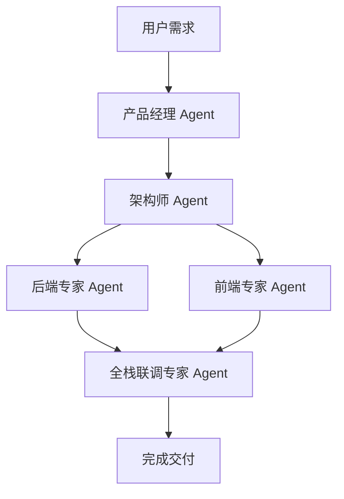
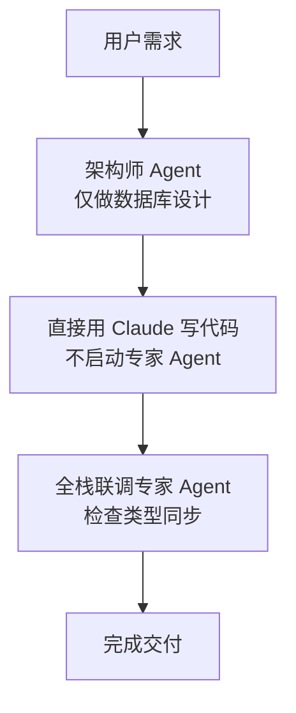
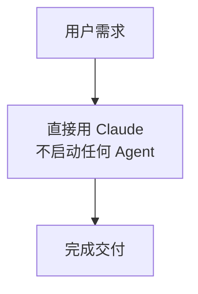

# Agent 协作指南

> 适用于全栈开发项目的 Agent 划分和使用指南
>
> **个人开发者省钱策略**：根据任务复杂度选择合适的流程，避免过度使用 Agent

---

## 📋 目录

- [Agent 角色概览](#agent-角色概览)
- [快速决策树](#快速决策树)
- [省钱使用策略](#省钱使用策略)
- [Agent 详细说明](#agent-详细说明)
- [协作流程](#协作流程)
- [常见场景示例](#常见场景示例)

---

## Agent 角色概览

| Agent | 主要职责 | 适用场景 | 成本级别 |
|-------|---------|---------|----------|
| **产品经理** | 需求分析、API 设计 | 复杂需求、新功能规划 | 💰 中 |
| **架构师** | 技术方案、数据库设计 | 新建表、架构调整 | 💰 中 |
| **后端专家** | Java 代码实现 | 实现后端接口 | 💰💰 高 |
| **前端专家** | Vue 代码实现 | 实现前端页面 | 💰💰 高 |
| **全栈联调专家** | 前后端对接、类型同步 | 接口修改、联调测试 | 💰 中 |

---

## 快速决策树

使用此决策树快速确定需要启动哪些 Agent：

```
我的需求是什么？
│
├─ 只是修改现有代码
│  ├─ 修改后端逻辑 → 直接用 Claude（不启动 Agent）
│  ├─ 修改前端页面 → 直接用 Claude（不启动 Agent）
│  └─ 修改接口定义 → 【全栈联调专家】
│
├─ 新增简单功能（CRUD）
│  ├─ 需求很明确 → 跳过【产品经理】
│  ├─ 表结构简单 → 【架构师】→ 【后端专家】或【前端专家】→ 【全栈联调专家】
│  └─ 只改一端 → 只启动对应的专家 Agent
│
├─ 新增复杂功能
│  └─ 完整流程 → 【产品经理】→ 【架构师】→ 【后端专家】+【前端专家】→ 【全栈联调专家】
│
└─ 技术决策/架构设计
   └─ 【架构师】
```

---

## 省钱使用策略

### 💡 策略 1：根据任务复杂度选择流程

#### 🟢 轻量级流程（推荐个人开发）
**适用场景：**
- 简单的 CRUD 功能
- 需求明确、表结构简单
- 时间紧迫、预算有限

**流程：**
```
跳过【产品经理】→ 【架构师】（只做数据库设计）→ 直接用 Claude 写代码 → 【全栈联调专家】检查
```

**节省成本：** 约 40-50%

---

#### 🟡 标准流程（中等复杂度）
**适用场景：**
- 中等复杂度功能
- 涉及多表关联
- 需要缓存或消息队列

**流程：**
```
【产品经理】→ 【架构师】→ 【后端专家】或【前端专家】（选一个）→ 【全栈联调专家】
```

**节省成本：** 约 20-30%

---

#### 🔴 完整流程（复杂功能）
**适用场景：**
- 核心业务功能
- 涉及多服务协作
- 需要完整的技术方案

**流程：**
```
【产品经理】→ 【架构师】→ 【后端专家】+【前端专家】→ 【全栈联调专家】
```

**成本：** 完整成本

---

### 💡 策略 2：合并 Agent 职责

#### 方案 A：产品经理 + 架构师 合并
**自己完成：**
- API 接口设计（参考已有接口）
- 表结构设计（参考已有表）

**让 Agent 做：**
- 只用【后端专家】或【前端专家】写代码
- 最后用【全栈联调专家】检查

**节省：** 2 个 Agent 的成本

---

#### 方案 B：直接用 Claude（最省钱）
**适用场景：**
- 极简单的修改
- 照搬已有功能
- 只改一两个文件

**操作：**
```
直接对话 Claude，明确告知：
"参考 UserController，帮我写一个 ProductController，
需要 CRUD 接口，表结构是：id, name, price, created_at, updated_at, is_deleted"
```

**节省：** 全部 Agent 成本

---

### 💡 策略 3：批量处理

**原则：** 一次性处理多个相似任务，避免重复启动 Agent

**示例：**
```
❌ 不好的做法：
- 启动 Agent 写 User CRUD
- 启动 Agent 写 Product CRUD
- 启动 Agent 写 Order CRUD

✅ 好的做法：
- 启动一次【架构师】，一次性设计 3 张表
- 启动一次【后端专家】，一次性写 3 个 Controller
- 启动一次【全栈联调专家】，统一检查
```

---

## Agent 详细说明

### 1. 产品经理 Agent

#### 何时使用
- ✅ 需求不明确，需要梳理
- ✅ 复杂业务流程，需要拆解
- ✅ 需要设计多个接口
- ❌ 简单 CRUD（可跳过）
- ❌ 需求已经很清楚（可跳过）

#### 输入示例
```
"我想做一个用户积分系统，用户可以通过签到、购物获得积分，
积分可以兑换优惠券，需要记录积分变更历史"
```

#### 输出
- 用户故事
- API 接口设计（路径、请求/响应格式）
- 数据模型（字段列表）
- 开发任务清单

#### 触发关键词
- "我想实现【功能】"
- "帮我分析【需求】"
- "【功能】的 API 应该怎么设计"

---

### 2. 架构师 Agent

#### 何时使用
- ✅ 需要新建数据库表
- ✅ 需要技术方案（缓存、消息队列）
- ✅ 跨服务调用设计
- ⚠️ 表结构很简单（可以自己写 DDL）
- ❌ 只是改业务逻辑，不涉及表结构

#### 输入示例
```
"设计用户积分表，需要记录余额、累计收入、累计支出，
还需要一张积分变更记录表，记录每次变更的来源和金额"
```

#### 输出
- SQL DDL（CREATE TABLE 语句）
- 索引设计
- 缓存策略
- 跨服务通信方案（Feign/RabbitMQ）

#### 触发关键词
- "设计【功能】的数据库表"
- "【功能】的技术方案是什么"
- "如何实现【功能】的缓存"

---

### 3. 后端专家 Agent

#### 何时使用
- ✅ 实现后端接口（Controller/Service/Mapper）
- ✅ 集成 Redis、RabbitMQ
- ✅ 创建 Feign 客户端
- ❌ 只是修改几行代码（直接用 Claude）

#### 输入示例
```
"实现用户积分的 CRUD 接口，表结构已经设计好了，
需要使用 Redis 缓存用户积分余额，过期时间 30 分钟"
```

#### 输出
- Controller（含 Knife4j 注解）
- Service（业务逻辑 + 缓存）
- Mapper
- Entity/DTO/Request 类

#### 触发关键词
- "实现【功能】的后端接口"
- "写【功能】的 Controller/Service/Mapper"
- "集成 Redis 缓存"

---

### 4. 前端专家 Agent

#### 何时使用
- ✅ 实现 Vue 页面和组件
- ✅ 编写 TypeScript 类型
- ✅ 封装 API 请求函数
- ❌ 只是改几个字段（直接用 Claude）

#### 输入示例
```
"实现用户积分管理页面，包括：
1. 积分余额卡片（显示当前余额、累计收入、累计支出）
2. 积分变更记录表格（分页查询）
3. 手动调整积分的对话框"
```

#### 输出
- TypeScript 类型定义（src/types/api.d.ts）
- API 请求函数（src/api/xxx.ts）
- Vue 页面组件
- Pinia Store（如需要）

#### 触发关键词
- "实现【功能】的前端页面"
- "写【功能】的 Vue 组件"
- "定义【接口】的 TypeScript 类型"

---

### 5. 全栈联调专家 Agent

#### 何时使用
- ✅ 修改了后端接口定义（必须用）
- ✅ 新增接口，需要同步前端类型（必须用）
- ✅ 前后端对接报错（必须用）
- ⚠️ 只改后端逻辑，接口定义不变（可跳过）

#### 输入示例
```
"后端 CreateUserRequest 新增了 phone 和 businessLine 字段，
帮我同步前端类型，并列出需要修改的文件"
```

#### 输出
- 前端受影响文件清单
- 同步后的 TypeScript 类型
- 修改后的前端代码
- 联调检查清单

#### 触发关键词
- "前后端联调"
- "同步前端类型"
- "修改【接口】需要改前端哪些地方"
- "前端调用【接口】报错"

---

## 协作流程

### 完整流程（复杂功能）



**步骤：**
1. 【产品经理】分析需求 → 输出 API 设计
2. 【架构师】设计方案 → 输出 SQL DDL
3. 【后端专家】实现后端 → 输出 Java 代码
4. 【前端专家】实现前端 → 输出 Vue 代码
5. 【全栈联调专家】检查对接 → 输出联调文档

---

### 轻量级流程（简单功能，省钱）



**步骤：**
1. 【架构师】设计表结构 → 输出 SQL DDL
2. 直接对话 Claude 写代码（不启动 Agent）
3. 【全栈联调专家】检查前后端类型是否一致

**节省：** 跳过【产品经理】+【后端专家】+【前端专家】

---

### 极简流程（超简单功能，最省钱）



**适用场景：**
- 修改现有代码
- 简单的字段增删
- 照搬已有功能

**操作：**
直接对话 Claude，给出明确指令，参考已有代码

---

## 常见场景示例

### 场景 1：新增简单 CRUD 功能

**需求：** 新增商品管理（增删改查）

**💰 省钱方案（推荐）：**
```
步骤1：自己设计表结构（参考已有的 user 表）
步骤2：直接对话 Claude：
      "参考 UserController，帮我写一个 ProductController，
       CRUD 接口，表结构：id, name, price, stock, created_at, updated_at, is_deleted"
步骤3：让 Claude 同步生成前端类型和 API 函数
步骤4：测试接口
```

**成本：** 0 个 Agent

---

**💰💰 标准方案：**
```
步骤1：启动【架构师】设计表结构
步骤2：启动【后端专家】实现 Controller/Service/Mapper
步骤3：启动【前端专家】实现页面组件
步骤4：启动【全栈联调专家】检查对接
```

**成本：** 4 个 Agent

---

### 场景 2：修改现有接口

**需求：** UserController.createUser 新增 phone 字段

**💰 省钱方案（推荐）：**
```
步骤1：直接启动【全栈联调专家】
步骤2：告诉它："CreateUserRequest 新增 phone 字段，
       帮我同步前端类型，并修改 UserForm.vue"
```

**成本：** 1 个 Agent

---

**💰💰 不推荐方案：**
```
❌ 分别启动【后端专家】和【前端专家】修改代码
```

**成本：** 2 个 Agent（浪费！）

---

### 场景 3：复杂业务功能

**需求：** 用户积分系统（签到、消费、兑换、记录）

**💰💰 完整方案（推荐）：**
```
步骤1：启动【产品经理】梳理需求和 API
步骤2：启动【架构师】设计表结构和缓存策略
步骤3：启动【后端专家】实现后端接口
步骤4：启动【前端专家】实现管理页面
步骤5：启动【全栈联调专家】检查对接
```

**成本：** 5 个 Agent（必要成本，不要省）

---

### 场景 4：只做后端/只做前端

**需求：** 只实现后端接口（前端暂时不做）

**💰 省钱方案（推荐）：**
```
步骤1：启动【架构师】设计表结构
步骤2：启动【后端专家】实现接口
步骤3：用 Knife4j 测试接口（不需要前端）
```

**成本：** 2 个 Agent

**注意：** 跳过【全栈联调专家】，因为没有前端对接

---

### 场景 5：批量处理相似功能

**需求：** 同时做 User、Product、Order 三个模块的 CRUD

**💰 省钱方案（推荐）：**
```
步骤1：启动【架构师】，一次性设计 3 张表
步骤2：启动【后端专家】，一次性写 3 个 Controller
       （明确告诉它："参考 UserController，帮我写 ProductController 和 OrderController"）
步骤3：启动【前端专家】，一次性写 3 个页面
步骤4：启动【全栈联调专家】，统一检查
```

**成本：** 4 个 Agent

---

**💰💰💰 不推荐方案：**
```
❌ 每个模块都走一遍完整流程（3 轮 × 5 个 Agent = 15 次调用）
```

**成本：** 15 个 Agent（浪费太多！）

---

## 成本优化建议总结

### ✅ 推荐做法

1. **简单功能直接用 Claude**
   - CRUD、字段增删、修改逻辑
   - 参考已有代码，给出明确指令

2. **批量处理相似任务**
   - 一次启动 Agent 处理多个模块
   - 避免重复调用

3. **只用必要的 Agent**
   - 需求明确 → 跳过【产品经理】
   - 表结构简单 → 自己写 DDL，跳过【架构师】
   - 只做一端 → 跳过另一端的专家

4. **合并职责**
   - 接口定义 + 类型同步 → 只用【全栈联调专家】

---

### ❌ 避免做法

1. **过度依赖 Agent**
   - 简单修改也启动完整流程

2. **重复调用**
   - 相似功能分开处理

3. **不必要的 Agent**
   - 需求明确还用【产品经理】
   - 不涉及前端还用【前端专家】

---

## 快速参考表

| 场景 | 推荐流程 | 成本 |
|------|---------|------|
| 简单 CRUD | 直接用 Claude | 0 |
| 修改现有接口 | 【全栈联调专家】 | 1 |
| 新建表 + CRUD | 【架构师】→ Claude 写代码 → 【全栈联调专家】 | 2 |
| 中等复杂功能 | 【架构师】→ 【后端专家】或【前端专家】→ 【全栈联调专家】 | 3 |
| 复杂业务功能 | 【产品经理】→ 【架构师】→ 【后端专家】+【前端专家】→ 【全栈联调专家】 | 5 |
| 批量相似功能 | 各 Agent 一次性处理多个模块 | 按需 |

---

## 使用技巧

### 💡 技巧 1：明确指令，减少来回沟通

**❌ 不好的提问：**
```
"帮我做一个用户管理"
```
→ Agent 会问很多问题，来回沟通增加成本

**✅ 好的提问：**
```
"参考 ProductController，帮我实现 UserController，
需要 CRUD 接口，表结构：id, username, email, phone, created_at, updated_at, is_deleted，
使用 Redis 缓存用户信息，过期时间 30 分钟"
```
→ 信息完整，Agent 直接输出结果

---

### 💡 技巧 2：善用"参考已有代码"

**示例：**
```
"参考 UserController 的写法，帮我写一个 ProductController"
"参考 UserList.vue，帮我实现 ProductList.vue"
```

**好处：**
- 保持代码风格一致
- 减少 Agent 思考时间
- 降低成本

---

### 💡 技巧 3：一次性提供完整信息

**❌ 分步提问（成本高）：**
```
第1次："帮我设计用户表"
第2次："再加个 phone 字段"
第3次："还要加个 business_line 字段"
```

**✅ 一次性提问（成本低）：**
```
"帮我设计用户表，字段：id, username, email, phone, business_line,
created_at, updated_at, is_deleted"
```

---

## 附录：Agent Prompt 位置

所有 Agent 的详细 Prompt 已在前面的对话中提供，包括：

1. [产品经理 Agent Prompt](#产品经理-agent-prompt)
2. [架构师 Agent Prompt](#架构师-agent-prompt)
3. [后端专家 Agent Prompt](#后端专家-agent-prompt)
4. [前端专家 Agent Prompt](#前端专家-agent-prompt)
5. [全栈联调专家 Agent Prompt](#全栈联调专家-agent-prompt)

创建 Agent 时，复制对应的完整 Prompt 即可。

---

## 总结

### 个人开发者省钱心法

1. **能自己做的不用 Agent**
   - 简单表结构自己写
   - 明确需求不用【产品经理】

2. **能直接用 Claude 的不启动 Agent**
   - 参考已有代码
   - 明确指令

3. **能合并的不分开**
   - 批量处理相似任务
   - 一次性提供完整信息

4. **能省略的坚决省**
   - 只做一端，不用另一端的 Agent
   - 需求明确，跳过【产品经理】

5. **必要的不能省**
   - 复杂业务必须走完整流程
   - 接口修改必须用【全栈联调专家】检查

---

**记住：Agent 是工具，不是目的。根据任务复杂度灵活选择，才是最经济的做法。**
