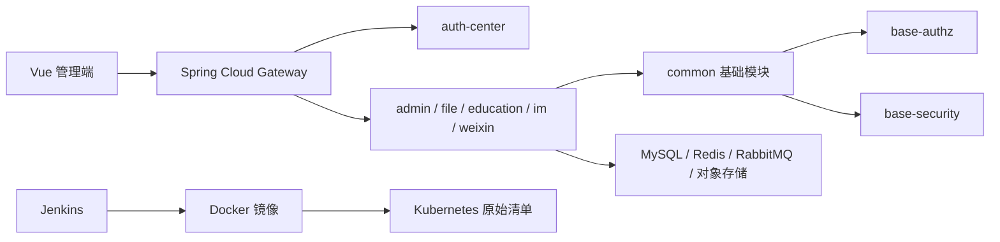
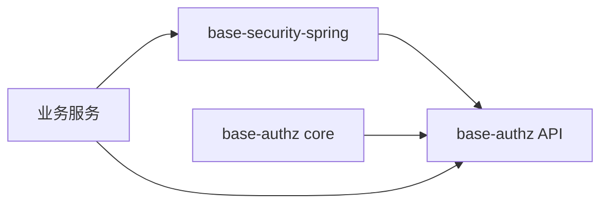

# 项目整体审计与重构建议报告

> 审计日期：2026-07-16
> 审计范围：`java-base-module`、`node-base-module`、`fn-devops`、根目录文档与持续集成配置
> 重点模块：`common/base-authz`、`common/base-security`
> 报告性质：基于当前工作区源码、配置、测试与构建结果的静态审计，不包含生产环境渗透测试、压测或线上数据核验

## 1. 执行摘要

项目已经具备较完整的基础设施雏形：Java 多模块边界基本形成，管理后台有类型检查与自动化测试，部署转换工具采用中间表示（IR）隔离不同格式，服务端也有统一返回结构、鉴权接口和消息基础设施。

当前主要问题不是“模块数量多”，而是**边界语义不够稳定、质量门禁不完整、部署安全基线偏弱**。其中鉴权链路存在可能导致认证失败或权限绕过的高风险问题，CI/CD 又普遍跳过或缺少测试，使这些问题难以及时暴露。

综合评估：**C（可运行，但不宜直接进行大爆炸式重构）**。

建议采用“先止血、再固化边界、最后拆分与提效”的渐进式重构：

1. 立即修复认证与授权链路，补齐回归测试并轮换已进入代码或配置历史的凭据。
2. 保留 `base-authz` 与 `base-security` 两个模块，不直接合并；重构为“与框架无关的授权内核 + Spring Security 适配器”。
3. 为 Maven、Node、镜像和 Kubernetes 建立统一质量门禁，禁止流水线跳过测试。
4. 再逐步治理跨层依赖、超大类、示例代码进入生产包、前端脚手架服务等结构问题。

## 2. 审计方法与验证结果

本次审计采用以下方式：

- 阅读父 POM、子模块 POM、前端 `package.json`、Jenkinsfile、Kubernetes YAML 和架构文档。
- 统计模块文件量、测试分布、超大文件和关键配置特征。
- 对认证、授权、网关、内部接口、WebSocket、Feign 合约和部署配置进行重点代码追踪。
- 执行当前仓库能够直接运行的测试、类型检查与构建命令。

### 2.1 验证矩阵

| 区域 | 命令 | 结果 | 说明 |
|---|---|---|---|
| Java 全模块 | `mvn test -Drevision=1.0` | 通过 | 26 个 Reactor 模块成功，约 12 秒；存在 POM 重复依赖警告 |
| `base-admin-web` 类型检查 | `npm run type-check` | 通过 | 严格类型检查通过 |
| `base-admin-web` 测试 | `npm test` | 通过 | 24 个测试文件、40 个测试通过 |
| `base-admin-web` 构建 | `npm run build` | 通过 | 存在 Sass 旧 API 和大体积 vendor chunk 警告 |
| `deploy-transform` 构建/测试 | `npm run build`、`npm test` | 未验证 | 本地未安装依赖，且没有 lockfile，命令分别缺少 `tsc`、`vitest` |
| `weixin-bot-admin` 构建 | `npm run build` | 未验证 | 本地未安装依赖，且没有 lockfile，命令缺少 `vite` |

“未验证”表示环境和依赖可复现性不足，不等同于源码编译失败。

### 2.2 规模概览

- Java 主代码约 4.48 万行，覆盖公共库、网关、认证中心和多个业务服务。
- Node/TypeScript 主代码约 0.97 万行。
- `base-security` 约 10 个主源码文件、无测试；`base-authz` 约 11 个主源码文件、仅 1 个测试。
- `base-admin-web` 有 104 个源码文件和 24 个测试文件。
- `fn-devops` 以原始 Kubernetes 清单为主，约 168 个资源声明，未发现 Helm Chart 或 Kustomize 基线。

## 3. 系统边界现状

当前系统可以概括为：



主要结构性矛盾有三类：

1. 文档宣称的安全责任与代码实际责任不一致，例如文档认为网关做基础 Token 校验，但当前过滤器主要做转发。
2. 公共模块同时混入领域模型、框架适配、示例接口和基础设施实现，依赖方向不够单一。
3. 开发环境能运行的验证没有完整进入 CI/CD，测试结果无法成为交付门禁。

## 4. 风险总览

| 编号 | 等级 | 领域 | 风险摘要 | 建议时限 |
|---|---|---|---|---|
| SEC-01 | P0 | 认证 | JWT 在过滤器和 Provider 之间被重复解析，契约不一致 | 立即 |
| SEC-02 | P0 | 授权 | 方法注解授权可能在过滤器阶段取不到 HandlerMethod 后默认放行 | 立即 |
| SEC-03 | P0 | 上下文 | 成功请求后未可靠清理 ThreadLocal 用户上下文 | 立即 |
| SEC-04 | P0 | 密钥 | 存在代码默认密钥、配置凭据和 Kubernetes Secret 固化风险 | 立即 |
| SEC-05 | P0 | 信任边界 | 网关、内部接口、WebSocket 的信任模型不闭合 | 立即 |
| QLT-01 | P0 | 测试 | 安全模块测试稀缺，RabbitMQ 测试可能未被 Surefire 执行 | 1 周内 |
| CICD-01 | P0 | 交付 | Java Jenkins 流水线显式跳过测试，部分 Node 流水线不测试 | 1 周内 |
| ARCH-01 | P1 | 架构 | Feign 合约暴露持久层分页类型，公共 API 与数据库框架耦合 | 1 月内 |
| ARCH-02 | P1 | 模块 | 公共模块含示例 Controller/消费者，自动配置职责过多 | 1 月内 |
| OPS-01 | P1 | 部署 | 大量 `hostPath`、明文式 Secret 清单和高权限配置 | 1 月内 |
| FE-01 | P1 | 前端 | 管理端 bundle 偏大，部分测试偏源码结构断言 | 1 月内 |
| FE-02 | P2 | 产品 | `weixin-bot-admin` 仍接近 Vue 默认欢迎页，却已有部署链路 | 规划确认 |

## 5. P0：必须优先整改的问题

### 5.1 JWT 输入契约不一致

`JwtAuthenticationFilter` 已从请求头中移除 `Bearer ` 前缀，再将裸 Token 传给 `SecurityAuthProvider.validateToken`；本地实现 `LocalJwtSecurityAuthProvider` 又调用 `extractTokenFromHeader`，仍按带前缀的请求头格式解析。

影响：有效 Token 可能被误判无效，或不同 Provider 实现出现互不兼容的行为。

整改建议：

- 将接口语义固定为 `validateToken(rawToken)`，只接收裸 Token；请求头解析只允许发生在适配层一次。
- 或把接口改为接收认证请求对象，明确包含 scheme、credentials 和来源，避免用字符串隐式传递协议状态。
- 增加带前缀、无前缀、空值、过期、签名错误、非 JWT 格式的契约测试。

证据位置：

- `java-base-module/common/base-security/src/main/java/com/xiwen/security/filter/JwtAuthenticationFilter.java`
- `java-base-module/common/base-security/src/main/java/com/xiwen/security/service/LocalJwtSecurityAuthProvider.java`

### 5.2 注解权限可能默认放行

`PermissionAuthorizationManager` 在 Spring Security 过滤器阶段尝试从请求属性读取 `HandlerMapping.bestMatchingHandler`。该阶段通常早于 DispatcherServlet 完成 HandlerMapping；获取不到 `HandlerMethod` 时，当前实现返回允许。

同时，业务服务的自定义安全链主要只要求 `.authenticated()`，并没有另一条可靠链路保证 `@RequirePermission` 一定执行。

影响：已登录用户可能绕过接口级权限注解，形成越权访问。

整改建议：

- 请求 URL 级规则放在 `SecurityFilterChain`，使用显式 matcher 与权限映射。
- 方法注解使用 Spring Method Security 或自定义 AOP，在控制器/服务方法调用阶段执行。
- “无法识别目标方法”不得作为默认放行依据；对受保护路径采用 fail closed。
- 为每种注解增加匿名、已登录无权限、有权限、ABAC 拒绝/通过的端到端测试。

证据位置：

- `java-base-module/common/base-security/src/main/java/com/xiwen/security/manager/PermissionAuthorizationManager.java`
- `java-base-module/server/admin/src/main/java/com/xiwen/server/admin/config/AdminSecurityConfig.java`
- `java-base-module/server/education/src/main/java/com/xiwen/server/education/config/EducationSecurityConfig.java`

### 5.3 用户上下文未形成可靠的请求生命周期

过滤器设置用户上下文后调用后续链路，但没有看到与之对应的 `finally` 清理。在线程池复用场景下，ThreadLocal 数据可能残留至后续请求。

影响：用户信息串请求、审计数据污染，极端情况下形成身份混淆。

整改建议：

```java
try {
    UserContextHolder.set(...);
    filterChain.doFilter(request, response);
} finally {
    UserContextHolder.clear();
}
```

同时增加同线程连续处理两个不同用户请求的回归测试。

### 5.4 密钥与配置安全基线不足

审计发现 JWT 工具存在默认密钥，部分本地配置、文档、Jenkins/Kubernetes 清单存在固定凭据或编码后 Secret 的使用模式。报告不复制任何实际值。

影响：凭据一旦进入 Git 历史，仅删除当前文件并不能消除泄露风险；默认值还可能误进入生产环境。

整改建议：

- 立即轮换已经进入仓库或构建日志历史的全部凭据。
- 生产配置缺少密钥时启动失败，禁止可工作的默认密钥。
- 使用 External Secrets、Vault、云密钥服务或等价方案；Git 中只保留 Secret 引用和示例键名。
- 在提交钩子和 CI 中加入 secret scanning，构建日志禁止 `printenv`。

证据位置：

- `java-base-module/common/base-security/src/main/java/com/xiwen/security/jwt/JwtUtil.java`
- `fn-devops/` 下 Jenkins 与 Kubernetes 配置
- Java 各服务资源配置及本地开发脚本

### 5.5 网关、内部接口与 WebSocket 信任边界不闭合

- Gateway 的认证过滤器当前主要透传请求，未实现文档所描述的基础 Token 校验。
- Gateway CORS 允许通配来源模式并允许携带凭据，生产环境边界过宽。
- `auth-center` 当前安全配置主要提供密码编码器，未看到完整的请求级 `SecurityFilterChain` 保护内部接口。
- WebSocket 使用查询参数传 Token 且允许任意来源，Token 更容易进入访问日志、代理日志和浏览器历史。

整改建议：

- 明确唯一认证入口：网关验证并签发内部可信身份，或各服务独立验证；不要处于“看似两边都验证，实际都依赖对方”的状态。
- `/inner/**` 使用 mTLS、服务身份或至少独立内部签名，并从公网路由彻底隔离。
- CORS 改为环境化白名单，凭据模式下禁止通配来源。
- WebSocket 优先使用受保护 Cookie、受控子协议或一次性短期票据，校验 `Origin`。

证据位置：

- `java-base-module/server/api-gateway/src/main/java/com/xiwen/gateway/filter/AuthGlobalFilter.java`
- `java-base-module/server/api-gateway/src/main/java/com/xiwen/gateway/config/CorsConfig.java`
- `java-base-module/server/auth-center/src/main/java/com/xiwen/server/auth/config/SecurityConfig.java`

### 5.6 测试存在“假绿”风险

Java 全量测试虽通过，但存在以下缺口：

- `base-security` 没有测试，`base-authz` 只有 1 个测试，无法覆盖关键安全契约。
- `base-rabbitmq` 有 JUnit 5 测试源码，但当前 Surefire 执行日志显示该模块运行测试数为 0，可能与旧版插件发现机制有关。
- 部分测试使用 Java 原生 `assert`；未启用 `-ea` 时断言不生效。
- Maven 提示 `server/file/pom.xml` 存在重复依赖声明。

整改建议：

- 在父 POM 的 `pluginManagement` 统一升级并锁定 Surefire/Failsafe。
- 使用 JUnit Assertions 或 AssertJ，禁止原生 `assert`。
- CI 校验预期测试数和 JaCoCo 覆盖率，防止“测试任务成功但零测试”。
- 安全模块首先建立契约测试和 MockMvc/WebTestClient 集成测试。

### 5.7 CI/CD 不具备交付门禁能力

当前 GitHub Actions 主要执行仓库镜像同步，没有构建测试。Java Jenkins 流水线存在 `maven.test.skip=true`，部分 Node 流水线只安装和构建；`deploy-transform` 流水线没有测试。流水线还存在输出环境变量、运行时动态拼接 Dockerfile、镜像推送步骤不一致等问题。

整改建议：

1. PR 阶段：编译、单测、类型检查、依赖漏洞扫描、secret scan、镜像与清单静态检查。
2. 合并阶段：构建不可变镜像，生成 SBOM，签名并推送。
3. 部署阶段：以镜像 digest 部署，运行 smoke test，再逐步放量。
4. 生产部署禁止 `kubectl apply` 未审阅的工作区临时文件。

## 6. `base-authz` 与 `base-security` 是否合并

### 6.1 结论

**不建议直接合并。** 两个模块解决的问题不同：

| 模块 | 应有职责 | 不应承担的职责 |
|---|---|---|
| `base-authz` | 权限模型、策略接口、权限判定结果、与框架无关的规则 | Servlet、Filter、Spring Security、JWT 请求头解析 |
| `base-security` | Spring Security 自动配置、认证过滤器、SecurityContext 适配、异常响应 | 业务权限模型、可执行任意表达式的策略内核、业务数据访问 |

直接合并会减少一个 Maven 模块，但会把领域授权模型与 Spring/Servlet/JWT 绑定得更紧，未来在 Gateway、WebFlux、消息消费或批任务中复用授权能力会更困难。

### 6.2 推荐目标结构

```text
common/
├── base-authz-api
│   ├── Permission
│   ├── AuthorizationRequest
│   ├── AuthorizationDecision
│   └── AuthorizationService
├── base-authz-core
│   ├── RBAC 规则
│   ├── 受限 ABAC 策略
│   └── 策略组合与审计事件
└── base-security-spring
    ├── SecurityFilterChain 自动配置
    ├── TokenResolver / AuthenticationProvider
    ├── Method Security 适配
    └── 统一 401/403 响应
```

如果当前团队规模较小，也可以暂时保留两个物理模块，只在包结构上实现上述三层；等边界稳定后再决定是否拆为三个 artifact。重构目标不是追求更多模块，而是建立单向依赖：



禁止 `base-authz` 反向依赖 `base-security`，也禁止核心策略依赖 Servlet 或 Spring MVC。

### 6.3 ABAC 表达式治理

当前表达式工具使用通用 SpEL 上下文，并存在空表达式直接通过的语义。若表达式可通过内部 HTTP 接口进入，将扩大表达式注入和任意方法访问风险。

建议：

- 使用 `SimpleEvaluationContext` 或自研有限 DSL，只开放明确字段和操作符。
- 策略创建时编译、校验和版本化，不在每次请求中接受任意表达式。
- 空策略应按场景明确为拒绝或配置错误，而不是隐式放行。
- 记录策略版本、输入摘要、判定结果和 traceId，敏感字段脱敏。

## 7. P1：架构与模块治理

### 7.1 Maven 依赖治理

问题：

- 父 POM 中部分三方库作为全局 dependencies 引入，而非只在 `dependencyManagement` 统一版本。
- `server/file` 有重复动态数据源依赖声明。
- 公共模块存在横向依赖扩散，例如 RabbitMQ 基础模块依赖文档模块并包含示例 Controller/消费者。

建议：

- 父 POM 只管理版本，子模块显式声明真正使用的依赖。
- 引入 Maven Enforcer：依赖收敛、禁止重复依赖、Java/Maven 版本、上层模块禁止反向依赖。
- 示例应用移至 `examples/` 或独立 demo 模块，不进入基础库生产 artifact。
- 用 ArchUnit 验证模块和包依赖方向。

### 7.2 Feign 合约去持久层化

多个 Feign API 暴露 MyBatis `Page`，使调用方被迫依赖持久层框架，也把数据库分页语义扩散到远程接口。

建议定义稳定 DTO：

```java
public record PageQuery(int page, int size) {}
public record PageResult<T>(long total, List<T> records) {}
```

远程合约只使用 JDK 类型和项目 API DTO；MyBatis Page 仅存在于服务实现内部。

### 7.3 服务内部按业务能力分层

部分 Service、配置类和消息类已达到 350～650 行。建议优先拆分高变更、高风险类，不按行数机械拆类：

- Controller：协议转换与输入校验。
- Application Service：用例编排、事务边界。
- Domain Service/Policy：业务规则。
- Repository/Client Adapter：数据库与远程系统。
- Event Handler：异步副作用。

每次拆分必须由现有行为测试保护，避免同时改包结构、协议和业务逻辑。

### 7.4 统一错误、日志和可观测性

在保留 `RI<T>` 的前提下统一：

- 错误码命名空间、HTTP 状态与业务错误映射。
- traceId、userId、service、operation、latency、result 等结构化字段。
- Micrometer 指标与 OpenTelemetry Trace。
- 认证失败、授权拒绝、内部调用、策略命中等安全审计事件。

日志禁止记录 Token、密码、完整 Cookie、Secret 和敏感个人数据。

## 8. 前端与 Node 项目审计

### 8.1 `base-admin-web`

优点：Vue 3 + TypeScript + Vite 技术栈清晰，严格类型检查通过，已有 24 个测试文件；API、store、路由和页面 composable 有初步分层。

问题与建议：

- Element Plus vendor chunk 约 900 KB，建议检查按需导入、路由级拆包和图标加载方式。
- 部分测试偏向源码文本、文件行数或结构断言，这类测试重构敏感但行为保障有限；逐步转为 composable、store、请求重试和页面权限的行为测试。
- 统一封装本地存储、错误提示、请求取消和刷新 Token；减少业务代码直接访问 `localStorage`。
- 增加 ESLint、Prettier、Vitest coverage 和至少一条 Playwright 核心链路。

### 8.2 `deploy-transform`

优点：Compose/Kubernetes 通过 IR 转换的方向正确，源码和测试分离清楚。

问题与建议：

- 缺少 lockfile，审计环境无法可复现安装，现有依赖未安装时构建和测试均不可执行。
- 对 YAML 锚点、未知字段、资源单位、Secret/ConfigMap、探针和存储的 round-trip 语义需要形成兼容矩阵。
- 转换器应默认不输出明文 Secret，并对 `privileged`、`hostNetwork`、`hostPath` 等高风险配置给出警告。

### 8.3 `weixin-bot-admin`

当前源码仍接近 Vue 默认欢迎页面，但已经存在构建与 Kubernetes/Jenkins 部署配置。

建议先做产品决策：

- 若尚未进入开发，暂停独立部署和运维资源，保留最小脚手架即可。
- 若确需独立应用，先补功能边界、路由、API 层、权限模型、测试和 lockfile，再恢复交付流水线。
- 若仅是 `base-admin-web` 的一个业务域，优先评估合并为路由模块，而不是维护第二套后台壳工程。

## 9. DevOps 与 Kubernetes 审计

### 9.1 当前风险特征

静态扫描发现大量原始 Kubernetes 清单，其中包括较多 `hostPath`、Secret、NodePort，以及少量 `privileged`、`hostNetwork`。这些配置不一定都错误，但必须有明确的环境范围和审批依据。

### 9.2 整改建议

- 使用 Helm 或 Kustomize 管理 base 与环境 overlay，消除复制粘贴式 YAML 漂移。
- 默认启用 `runAsNonRoot`、只读根文件系统、drop capabilities、seccomp、资源 requests/limits。
- 用策略引擎阻止生产环境的特权容器、未批准 hostPath、latest tag 和无资源限制工作负载。
- 镜像采用多阶段构建、固定基础镜像 digest、生成 SBOM 并签名。
- Secret 只通过外部密钥系统注入；部署清单中不保存可还原的生产凭据。
- Deployment 补齐 readiness、liveness、startup probe、PDB 和滚动升级参数。
- Jenkins 共享库统一编译、测试、镜像、扫描、签名、发布与回滚逻辑。

## 10. 文档一致性审计

已有架构和模块文档提供了较好的起点，但存在“设计描述领先于实现”的情况，最典型的是网关 Token 校验职责。

建议把文档分为四类并明确所有者：

1. 架构决策记录（ADR）：记录为何选择独立 authz/security、认证入口、内部信任方式等不可逆决策。
2. 运行手册：本地启动、依赖服务、故障定位、回滚和密钥轮换。
3. API/事件契约：版本、兼容规则、错误码、幂等语义。
4. 重构计划：里程碑、验收标准、风险和迁移顺序。

每个关键文档增加“最后验证日期”和对应自动化检查，避免文档长期漂移。

## 11. 分阶段重构计划

### 阶段 0：建立基线（2～3 天）

目标：冻结事实，避免边重构边猜测。

- 建立模块依赖图、API 清单、数据库与消息契约清单。
- 将当前测试数、构建时间、bundle 大小和关键接口延迟记录为基线。
- 标记凭据、内部接口和高权限 Kubernetes 资源的所有者。
- 为后续重构建立 ADR 与风险登记表。

退出标准：每个模块有责任人、构建命令、测试命令和依赖边界说明。

### 阶段 1：安全止血与质量门禁（1～2 周，P0）

- 修复 JWT 裸 Token 契约与上下文清理。
- 将权限注解迁移到可靠的方法级授权机制，并默认拒绝异常状态。
- 收紧网关、内部接口、WebSocket 与 CORS。
- 轮换凭据，移除默认密钥，接入 secret scanning。
- 修复 Surefire 测试发现，给 authz/security 增加测试。
- CI 禁止跳过测试，Node 项目补 lockfile 和可复现安装。

退出标准：关键认证/授权矩阵测试全部通过；CI 任一测试失败即阻止合并和部署；仓库扫描不含有效生产凭据。

### 阶段 2：固化模块边界（2～4 周，P1）

- 将授权 API、核心策略和 Spring Security 适配分层。
- Feign 合约移除 MyBatis 类型。
- 公共模块移除示例应用和无关依赖。
- 引入 Maven Enforcer、ArchUnit、ESLint 和覆盖率阈值。
- 统一错误码、审计事件和可观测性字段。

退出标准：依赖图单向、无循环；核心授权模块不依赖 Spring MVC/Servlet；远程契约不暴露持久层类型。

### 阶段 3：业务服务渐进拆分（4～8 周，P1）

- 按变更频率和事故风险选择 2～3 个超大类先做试点。
- 以用例为单位拆 Application Service、Domain Policy 和 Adapter。
- 对关键业务补集成测试、契约测试和数据库迁移回滚测试。
- 将跨服务同步调用与消息事件分别建立超时、重试、幂等和补偿规范。

退出标准：试点模块的圈复杂度、变更失败率和回归时间下降；没有一次性全仓包名迁移。

### 阶段 4：交付平台化与前端治理（并行 3～6 周，P1/P2）

- 建立 Jenkins 共享流水线和 Kubernetes 环境 overlay。
- 增加镜像扫描、SBOM、签名、渐进发布和回滚验证。
- 优化管理端拆包、行为测试和 E2E 核心链路。
- 决定 `weixin-bot-admin` 独立、合并或暂停，清理无效部署资源。

退出标准：同一提交可在所有环境可重复构建；部署使用不可变镜像；核心用户链路有自动化回归。

## 12. 建议质量门禁

### Java

```bash
mvn clean verify -Drevision=1.0
```

应包含：编译、单元测试、集成测试、JaCoCo、SpotBugs/Checkstyle 或等价工具、Enforcer 和依赖漏洞扫描。

### `base-admin-web`

```bash
npm ci
npm run type-check
npm test
npm run build
```

补充 ESLint、覆盖率和 Playwright 后纳入同一门禁。

### 其他 Node 项目

统一提交 lockfile 后使用 `npm ci`；`deploy-transform` 必须运行 build + test，`weixin-bot-admin` 至少运行 type-check/test/build。

### 容器与部署

- Dockerfile lint、镜像漏洞扫描、SBOM 与签名。
- Kubernetes schema、策略和 Secret 扫描。
- 部署后 smoke test 与自动回滚条件。

## 13. 量化验收指标

建议以 8～12 周为首轮治理周期，使用以下指标验收：

| 指标 | 当前基线 | 首轮目标 |
|---|---:|---:|
| `base-security` 自动化测试 | 0 | 覆盖认证/授权关键矩阵，核心行覆盖率 ≥ 80% |
| CI 中跳过测试的交付流水线 | 存在 | 0 |
| 运行测试数为 0 的含测试源码模块 | 至少 1 | 0 |
| 有效凭据进入 Git/构建日志 | 存在风险 | 0，且完成轮换 |
| Feign 合约中的 MyBatis 分页类型 | 多处 | 0 |
| Node 应用缺 lockfile | 2 个 | 0 |
| 生产通配 CORS/任意 WebSocket Origin | 存在 | 0 |
| 未经批准的 privileged/hostNetwork/hostPath | 存在 | 0 |
| 管理端核心链路 E2E | 缺失 | 登录、权限、菜单、关键 CRUD 至少各 1 条 |

## 14. 建议后续产出

为降低实施歧义，建议在本报告之后依次补充：

1. `ADR-001-authz-security-boundary.md`：授权内核与 Spring Security 适配边界。
2. `ADR-002-service-trust-boundary.md`：网关、内部接口与服务身份方案。
3. `security-remediation-checklist.md`：P0 问题、责任人、截止时间和验证证据。
4. `refactor-roadmap.md`：把阶段计划拆为可排期任务，标注依赖与回滚方式。
5. `ci-quality-gates.md`：各模块统一的门禁命令和失败策略。

## 15. 最终结论

项目不需要通过“把模块合并”来证明重构有效。`base-authz` 与 `base-security` 应保持职责分离，但必须重新定义契约、依赖方向和执行时机。整体重构的首要目标也不是目录整齐，而是先消除权限绕过、上下文泄漏、默认密钥和测试假绿，再用自动化门禁保护后续结构调整。

推荐决策：**批准渐进式重构，暂缓大爆炸式改造；P0 安全与 CI 治理完成前，不开展大规模服务拆分。**
