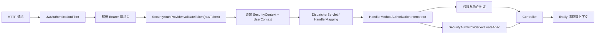

# Java 鉴权 P0 重构设计

> 日期：2026-07-17
>
> 范围：`java-base-module/common/base-security`，必要时联动 `server/admin` 与 `server/education` 做集成验证
>
> 状态：已批准，选择方案 A（JWT 过滤器认证 + MVC HandlerInterceptor 注解授权）

## 1. 背景

最新审计确认 Java 鉴权链路存在三个必须优先处理的问题：

1. `JwtAuthenticationFilter` 已移除 `Bearer ` 前缀，但 `LocalJwtSecurityAuthProvider` 再次按请求头格式解析，过滤器与 Provider 的 Token 契约不一致。
2. 过滤器成功设置 `SecurityContextHolder` 和 `UserContextHolder` 后，没有在请求结束时通过 `finally` 清理，线程复用时存在上下文残留风险。
3. `PermissionAuthorizationManager` 在 Spring Security 过滤器阶段读取 `HandlerMapping.bestMatchingHandler`；该阶段通常尚未完成 MVC HandlerMapping，获取不到 `HandlerMethod` 时当前实现默认允许，导致权限、角色和 ABAC 注解可能没有执行。

`base-security` 当前没有模块级测试，因此上述行为缺少稳定的回归保护。

## 2. 目标与非目标

### 2.1 目标

- 固定 `SecurityAuthProvider.validateToken(String rawToken)` 的输入语义：只接收裸 Token。
- 保证每个请求完成后都清理 Spring Security 与项目用户上下文，包括下游抛异常的情况。
- 在 MVC 已经解析出 `HandlerMethod` 后执行 `@RequiresPermission`、`@RequiresRole` 和 `@RequiresAbac`。
- 认证失败统一为 401，授权失败统一为 403，授权执行异常默认拒绝。
- 为认证、上下文生命周期和注解授权建立可重复执行的回归测试。
- 保持 `base-authz` 与 `base-security` 两个模块职责分离。

### 2.2 非目标

- 本批次不合并或拆分 Maven artifact。
- 不修改权限码注册表、角色分配、菜单和前端按钮权限。
- 不重写登录、刷新 Token 或 auth-center 业务流程。
- 不在本批次处理 ABAC 表达式 DSL、默认 JWT 密钥、网关和内部服务身份；这些进入后续 P0 批次。
- 不迁移到完整的 Spring Method Security。

## 3. 方案比较

### 方案 A：JWT 过滤器认证 + MVC 拦截器授权

过滤器只解析和验证身份，MVC `HandlerInterceptor` 在 `preHandle` 中读取已经确定的 `HandlerMethod` 并执行注解授权。

优点：改动范围小；能可靠读取控制器方法与请求参数；符合当前注解主要使用在 Controller 的事实；可以继续使用现有权限画像和 ABAC Provider。

缺点：只覆盖 Spring MVC Handler，不直接覆盖 Service 方法和非 HTTP 调用。

### 方案 B：Spring AOP 注解授权

通过切面拦截带有自定义注解的方法。

优点：可以覆盖 Controller 和 Service；不依赖 MVC HandlerMapping。

缺点：存在代理、自调用和切面顺序问题；ABAC 获取请求参数需要额外依赖 RequestContext；第一批止血复杂度偏高。

### 方案 C：Spring Method Security

将自定义注解迁移为方法安全表达式或自定义 Method `AuthorizationManager`。

优点：与 Spring Security 体系结合最完整，长期扩展性最好。

缺点：需要重新设计注解解析、方法参数到 ABAC 资源属性的映射和异常处理，改动半径最大。

### 决策

采用方案 A。当前优先消除实际权限绕过风险，并保留未来迁移到方案 C 的可能性。授权判定逻辑保持独立，避免把规则永久绑定在拦截器内部。

## 4. 目标架构



依赖方向保持为：

```text
业务服务 -> base-security -> base-authz
```

`base-authz` 不依赖 Servlet、Spring MVC 或 Spring Security。

## 5. 组件设计

### 5.1 Token 解析与 Provider 契约

`JwtAuthenticationFilter` 是 HTTP 协议适配边界，唯一负责：

- 读取 `Authorization` 请求头。
- 校验 scheme 必须为 `Bearer`，大小写兼容。
- 去掉前缀并拒绝空 credentials。
- 将裸 Token 传给 `SecurityAuthProvider.validateToken`。

`LocalJwtSecurityAuthProvider` 不再调用 `JwtUtil.extractTokenFromHeader`，只对收到的裸 Token 执行验签和 userId 提取。

接口文档明确：

```java
/** 验证裸 Token，返回 userId；无效返回 null。 */
Long validateToken(String rawToken);
```

### 5.2 请求上下文生命周期

过滤器在验证成功后设置：

- `SecurityContextHolder`：供 Spring Security 的 `authenticated()` 判断使用。
- `UserContextHolder`：保存完整 `PermissionProfile`，供权限、角色和 ABAC 判定使用。

后续过滤链必须包在 `try/finally` 中。无论 Controller 正常返回、授权拒绝还是下游抛异常，`finally` 都调用 `SecurityContextHelper.clear()`。

认证失败发生在设置上下文之前，也调用一次清理，确保异常入口没有残留状态。

### 5.3 HandlerMethod 注解授权

新增具体的 MVC 拦截器 `HandlerMethodAuthorizationInterceptor`：

- 非 `HandlerMethod` 请求直接跳过。
- 没有权限、角色或 ABAC 注解的方法不增加额外限制；请求是否需要登录仍由 `SecurityFilterChain` 决定。
- 有注解但不存在当前用户或权限画像时拒绝。
- 方法注解优先于类注解。
- 权限与角色继续使用 `PermissionMatchUtil` 和注解的 `MatchMode`。
- ABAC 请求继续包含 action、resourceType、requiredPermissions、请求参数以及 method/uri 环境信息。
- 任一判定失败或判定过程异常都拒绝访问。

`BaseSecurityAutoConfiguration` 注册该拦截器，并将默认安全链改为：公开路径 `permitAll()`，其他路径 `authenticated()`。注解授权不再由过滤器阶段的 `PermissionAuthorizationManager` 承担。

业务服务自定义安全链继续负责 URL 认证，MVC 拦截器统一负责注解授权，因此 `admin` 和 `education` 不需要复制注解判定逻辑。

### 5.4 兼容处理

现有未注册的 `AbstractAuthInterceptor` 与过滤器职责重复，而且仍按完整 Authorization 请求头调用 Provider。本批次不让它进入新链路。实施时只删除确认没有仓库内消费者且会造成契约歧义的代码；若兼容风险无法排除，则标记废弃并明确其旧契约，后续单独移除。

`PermissionAuthorizationManager` 不再接入 `SecurityFilterChain`。为避免一次提交同时扩大公共 API 破坏面，可以先保留类并标记废弃，待仓库内外调用确认后删除。

## 6. 错误处理

| 场景 | 响应 | 原则 |
|---|---:|---|
| 缺少 Authorization | 401 | 不进入业务处理 |
| scheme 不是 Bearer | 401 | 不把整个请求头当作 Token |
| Bearer credentials 为空 | 401 | 明确拒绝 |
| Token 无效或过期 | 401 | 不回显底层验签异常和 Token 内容 |
| 已认证但权限/角色不足 | 403 | 与认证失败区分 |
| ABAC 拒绝 | 403 | 默认拒绝 |
| 授权执行异常 | 403 | fail closed，并记录不含敏感值的服务端日志 |

错误正文继续兼容项目现有统一响应语义；本批次不重新设计全局错误码体系。

## 7. 测试设计

### 7.1 Provider 契约测试

- 裸 Token 直接传给 `JwtUtil.validateToken` 与 `extractUserId`。
- 不再调用请求头解析方法。
- 无效 Token 和解析异常返回 `null`。

### 7.2 过滤器测试

- `Bearer valid-token` 只向 Provider 传入 `valid-token`。
- Bearer scheme 大小写兼容。
- 缺失、错误 scheme、空 credentials 和 Provider 拒绝均返回 401。
- 验证成功时下游能够读取双上下文。
- 下游正常返回和抛异常后，双上下文均为空。
- 白名单请求不进入认证过滤。

### 7.3 注解授权测试

使用测试 Controller 方法构造真实 `HandlerMethod`，覆盖：

- 无注解方法通过。
- 有权限通过、缺权限拒绝。
- 角色 ANY/ALL 判定。
- ABAC 通过、拒绝和 Provider 异常。
- 类注解与方法注解优先级。
- 有注解但没有当前用户或权限画像时拒绝。

### 7.4 配置集成测试

- 自动配置能够注册 JWT 过滤器和 MVC 授权拦截器。
- 默认安全链不再依赖过滤器阶段解析 `HandlerMethod`。
- `admin` 和 `education` 的自定义安全链仍要求受保护路径已认证。

所有生产代码修改遵循 RED → GREEN → REFACTOR；每个提交同时包含先失败后通过的测试和对应最小实现。

## 8. 原子提交边界

1. `fix(security): 统一 JWT 裸令牌契约`
   - 增加 `base-security` 测试基础设施。
   - 添加 Provider 与过滤器 Token 契约测试。
   - 只修改 Token 解析职责。
2. `fix(security): 请求结束清理安全上下文`
   - 添加正常与异常请求生命周期测试。
   - 用 `finally` 清理双上下文。
3. `fix(security): 在 HandlerMapping 后执行注解授权`
   - 添加 HandlerMethod 授权测试。
   - 注册 MVC 拦截器，默认安全链只负责认证。
4. `test(security): 补齐认证授权回归矩阵`
   - 增加自动配置和服务安全链集成覆盖。
   - 不引入新的生产行为。

每个提交完成后执行目标模块测试；第四个提交完成后执行 Java 全量测试。任何失败都在当前提交内修复，不把红灯状态提交到分支。

## 9. 验收标准

- Provider 对裸 Token 只解析一次，测试能够证明没有重复处理 Bearer 前缀。
- 请求结束后 `SecurityContextHolder` 和 `UserContextHolder` 均为空。
- 带 `@RequiresPermission`、`@RequiresRole` 或 `@RequiresAbac` 的 HandlerMethod 不会因过滤器阶段取不到 Handler 而默认放行。
- 未认证返回 401，已认证但授权失败返回 403。
- `base-security` 有可执行的认证、上下文与授权测试。
- `mvn test -Drevision=1.0` 全量通过。
- 一个逻辑修改一个提交，提交历史可独立审阅和回滚。

## 10. 后续批次

本批次验收后，下一轮 P0 按独立设计处理：

1. 移除 JWT 可工作的默认密钥并建立配置启动校验。
2. 将 ABAC 从通用 `StandardEvaluationContext` 收紧为受限表达式能力。
3. 收紧网关、内部接口、WebSocket 与 CORS 信任边界。
4. 修复 Surefire 测试发现与 CI/CD 跳过测试问题。
