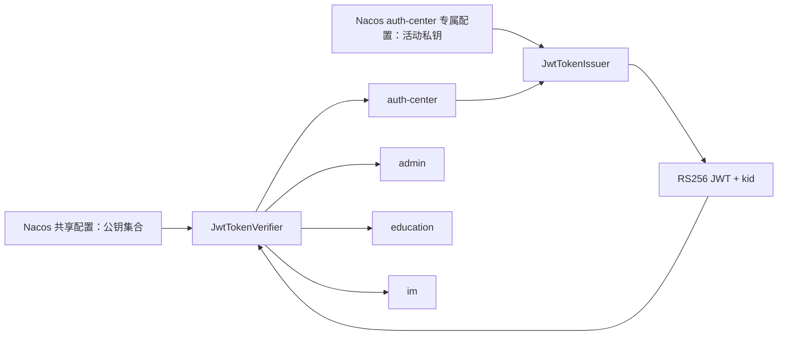

# Java JWT 非对称签名与密钥硬化设计

> 日期：2026-07-17
>
> 范围：`java-base-module/common/base-security`、`server/auth-center`，联动 `admin`、`education`、`im` 和仓库配置样例
>
> 状态：已批准，采用 RS256 非对称签名方案

## 1. 背景

上一批鉴权 P0 重构已经统一 JWT 裸令牌契约、修复请求上下文残留，并将注解授权迁移到能够可靠取得 `HandlerMethod` 的 MVC 阶段。

当前 `JwtUtil` 仍有三个长期风险：

1. `jwt.secret` 带有可工作的代码默认值。Nacos 配置缺失或加载失败时，服务仍可能使用仓库默认密钥启动。
2. 认证中心和业务服务共享同一个 HMAC 密钥。任何能够本地验签的服务也具备签发有效 Token 的能力，单个业务服务失陷会扩大为全系统身份伪造风险。
3. 同一个工具类同时承担 Bearer 请求头解析、Token 签发、验签和 Claim 提取，调用方多次解析同一 Token，协议边界和密钥权限边界不清晰。

此外，`jwt.access-token-expiration` 与 `jwt.refresh-token-expiration` 虽然被注入 `JwtUtil`，但签发逻辑实际始终使用 `ClientType` 定义的有效期。这两个配置从未参与运行时决策，容易误导运维人员。

项目尚未上线，本次允许直接废弃旧 HMAC Token，不需要双密钥兼容或用户无感迁移。目标是建立适合长期演进的最小权限密钥架构，而不只是删除一个默认字符串。

## 2. 目标与非目标

### 2.1 目标

- 使用明确的 RS256 非对称算法替代共享 HMAC 密钥。
- 只有 `auth-center` 持有私钥和签发能力；业务服务只持有公钥和验签能力。
- Token Header 包含 `kid`，验证端按 `kid` 从公钥集合选择密钥。
- 由 Nacos 显式提供密钥配置，缺失、格式错误或强度不足时应用启动失败。
- 将签发、验签、Bearer 解析和类型化 Claim 拆为单一职责组件。
- 一次验签返回类型化 Claim，消除“先 validate、再多次 parse”的重复解析。
- 强制校验算法、Issuer、Audience、有效期和 Token 类型。
- 删除未生效的 JWT 有效期配置，明确 `ClientType` 是唯一 Token 生命周期来源。
- 清理当前完整 Refresh Token 和 Token 前缀日志。
- 为密钥配置、签发、验签和调用方迁移建立自动化回归测试。

### 2.2 非目标

- 不兼容旧 HMAC Token，切换后所有旧 Token 立即失效。
- 不保留或备份生产可编译的旧 `JwtUtil` 案例。
- 不实现私钥 Key Ring、双私钥签发或动态热刷新。
- 不自动生成生产密钥，不自动修改真实 Nacos。
- 不在本批次改造 Refresh Token 哈希存储、一次性轮换和 Redis 原始 Token Key。
- 不在本批次处理 Gateway、`/inner/**` 信任边界或 ABAC 表达式。

## 3. 方案比较与决策

### 方案 A：保留共享 HMAC，只删除默认值

改动最小，但所有验签服务仍共享签发权限。业务服务失陷后，攻击者可以自行签发系统认可的 Token，无法形成最小权限边界。

### 方案 B：RS256 非对称签名

认证中心使用私钥签发，业务服务使用公钥验签。公钥泄露不产生签发能力；Token 通过 `kid` 为未来密钥轮换保留协议入口。代价是需要区分签发端和验证端配置，并迁移现有 `JwtUtil` 调用方。

### 方案 C：集中式 Token Introspection

业务服务不本地验签，每次请求调用认证中心校验。密钥集中，但会把认证中心的延迟和可用性放大到每个业务请求，还需要缓存、熔断和一致性设计。

### 决策

采用方案 B，并明确使用 RS256。当前 Java 21、JJWT 和常见网关/工具链对 RSA JWT 支持成熟；相比共享 HMAC，它能用清晰的私钥/公钥权限边界降低横向风险。

## 4. 目标架构



依赖与权限边界：

```text
auth-center  -> JwtTokenIssuer + JwtTokenVerifier
业务服务     -> JwtTokenVerifier
HTTP 适配层  -> BearerTokenResolver
```

业务服务的生产代码和配置中均不存在私钥，也不暴露 Token 签发接口。即使业务服务被攻破，攻击者最多读取公开验签材料，不能生成有效签名。

## 5. 组件设计

### 5.1 `JwtVerifierProperties`

位于 `base-security`，绑定所有验签方都需要的配置：

- `issuer`
- `audience`
- `public-keys`：`kid -> Base64(X.509 DER public key)`

启动时校验：Issuer、Audience 非空；公钥集合非空；`kid` 非空且唯一；每个值都能解析为 RSA 公钥；RSA 模数至少 2048 位。

### 5.2 `JwtIssuerProperties`

位于 `auth-center`，只绑定签发端配置：

- `active-key-id`
- `private-key`：`Base64(PKCS#8 DER private key)`

启动时校验：活动 `kid` 存在于公钥集合；私钥能解析为 RSA 私钥；RSA 模数至少 2048 位；私钥与活动公钥是一对。验证配对时只使用固定测试数据完成签名/验签，不输出密钥内容。

### 5.3 `JwtTokenIssuer`

只存在于 `auth-center`：

- 使用活动 RSA 私钥签发。
- 显式指定 RS256。
- Header 写入活动 `kid`。
- 分别提供 Access Token 与 Refresh Token 签发方法。
- Token 生命周期只读取 `ClientType`。

### 5.4 `JwtTokenVerifier`

位于 `base-security`：

- 读取 Header，拒绝缺少 `kid` 或算法不是 RS256 的 Token。
- 按 `kid` 选择公钥，未知 `kid` 直接拒绝。
- 一次性校验签名、Issuer、Audience、过期时间和必需 Claim。
- `verifyAccessToken` 只接受 `ACCESS`。
- `verifyRefreshToken` 只接受 `REFRESH`。
- 成功后返回不可变的 `VerifiedJwtClaims`。

### 5.5 `VerifiedJwtClaims`

使用不可变类型承载已验证数据：

- `jti`
- `userId`
- `username`
- `clientType`
- `tokenType`
- `issuedAt`
- `expiresAt`
- `issuer`
- `audience`
- `keyId`

调用方不能从未验证的原始 Claim Map 读取身份数据。

### 5.6 `BearerTokenResolver`

只负责 HTTP 协议适配：

- 接受大小写不敏感的 Bearer scheme。
- 拒绝缺失、错误 scheme 和空 credentials。
- 返回裸 Token。

JWT 签发器和验签器不再解析 Authorization Header。

## 6. Nacos 配置契约

### 6.1 所有验签服务可读的共享配置

```yaml
jwt:
  verifier:
    issuer: xiwen-auth-center
    audience: xiwen-services
    public-keys:
      key-2026-01: ${JWT_PUBLIC_KEY_2026_01}
```

### 6.2 仅 `auth-center` 可读的专属配置

```yaml
jwt:
  issuer:
    active-key-id: key-2026-01
    private-key: ${JWT_PRIVATE_KEY_2026_01}
```

密钥使用 Base64 编码 DER：私钥为 PKCS#8，公钥为 X.509 SubjectPublicKeyInfo。这样可以避免多行 PEM 在 Nacos 和 YAML 中的转义问题。

Nacos ACL 必须保证业务服务身份无权读取 `auth-center` 私钥配置。仓库只保留占位符、Data ID 约定和配置说明，不保存真实密钥。Nacos 传输应启用 TLS，私钥配置应使用 Nacos 的加密能力或外部密钥系统保护。

本批次删除以下无效配置：

- `jwt.access-token-expiration`
- `jwt.refresh-token-expiration`

## 7. Token 契约

### 7.1 Header

| 字段 | 要求 |
|---|---|
| `alg` | 必须为 `RS256` |
| `typ` | `JWT` |
| `kid` | 必须存在于验证端公钥集合 |

### 7.2 Claims

| Claim | 含义 | 校验 |
|---|---|---|
| `iss` | 签发者 | 必须等于配置值 |
| `aud` | 目标服务域 | 必须包含配置值 |
| `sub` | 用户 ID 字符串 | 必须存在且能转换为 Long |
| `jti` | Token 唯一标识 | 每次签发生成随机 UUID |
| `iat` | 签发时间 | 必须存在 |
| `exp` | 过期时间 | 必须存在且未过期 |
| `userId` | 用户 ID | 必须与 `sub` 一致 |
| `username` | 当前兼容字段 | 必须存在 |
| `clientType` | 客户端类型 | 必须映射到 `ClientType` |
| `tokenType` | `ACCESS` 或 `REFRESH` | 必须与验证入口匹配 |

Token 有效期继续且仅由 `ClientType` 决定。若未来需要动态有效期，应单独重构 `ClientType` 契约，不能恢复一组不生效的配置项。

## 8. 运行时流程

### 8.1 签发

1. `auth-center` 完成登录认证。
2. `JwtTokenIssuer` 读取活动 `kid` 和私钥。
3. 按 `ClientType` 计算有效期并构造必需 Claim。
4. 使用 RS256 签名并返回 Token。

### 8.2 业务服务验签

1. `BearerTokenResolver` 从请求头取得裸 Token。
2. `JwtTokenVerifier.verifyAccessToken` 读取 Header。
3. 校验算法和 `kid`，选择对应公钥。
4. 一次完成签名、Issuer、Audience、有效期与 Claim 校验。
5. 返回 `VerifiedJwtClaims`，认证链使用其中的 userId 构建上下文。

### 8.3 刷新

1. 刷新接口直接接收裸 Refresh Token 字段。
2. `verifyRefreshToken` 强制 `tokenType=REFRESH`。
3. 认证中心继续检查数据库 Token 记录。
4. 使用签发器创建新的 Access Token。

Refresh Token 当前仍可重复使用，哈希存储和一次性轮换作为下一独立安全批次处理。

## 9. 调用方迁移

| 当前调用方 | 目标依赖 |
|---|---|
| `AuthService` 登录 | `JwtTokenIssuer` |
| `AuthService` 登出/验证 | `BearerTokenResolver` + `JwtTokenVerifier` |
| `TokenService` 刷新/续期 | `JwtTokenIssuer` + `JwtTokenVerifier` |
| `LocalJwtSecurityAuthProvider` | `JwtTokenVerifier` |
| `WebSocketAuthInterceptor` | `JwtTokenVerifier` |
| `InnerPermissionValidationController` | `JwtTokenVerifier` |

全部迁移完成并通过测试后删除 `JwtUtil`。不保留生产源码、测试夹具或文档中的旧共享密钥实现案例。

## 10. 错误与日志处理

| 场景 | 行为 |
|---|---|
| 公钥配置缺失或非法 | 服务启动失败 |
| 私钥配置缺失或非法 | `auth-center` 启动失败 |
| 私钥与活动公钥不匹配 | `auth-center` 启动失败 |
| 缺少或未知 `kid` | 验签失败 |
| 算法不是 RS256 | 验签失败 |
| 签名、Issuer、Audience 或有效期错误 | 验签失败 |
| Access/Refresh 类型不匹配 | 验签失败 |
| Claim 缺失、格式错误或互相矛盾 | 验签失败 |

配置错误只输出配置路径、密钥类型和约束，不输出 Base64 值、密钥摘要或片段。Token 验证失败只记录分类、traceId 和必要上下文，不记录完整 Token、Token 前缀或 Claim 原文。

本批次必须删除：

- 管理端刷新接口中的完整 Refresh Token 日志。
- Token Service 和 Token Repository 中的 Token 前缀日志。

## 11. 测试设计

### 11.1 密钥配置测试

- 缺失、空白、非法 Base64 和错误 DER 格式启动失败。
- 非 RSA 密钥和少于 2048 位的 RSA 密钥失败。
- 活动 `kid` 不存在失败。
- 私钥与活动公钥不配对失败。
- 配置异常不包含测试密钥内容。

### 11.2 签发器测试

- 使用测试 RSA KeyPair 签发 Access/Refresh Token。
- Header 固定为 RS256 并包含活动 `kid`。
- 必需 Claim 完整，`sub` 与 userId 一致。
- 有效期来自 `ClientType`。
- 每次签发生成不同 `jti`。

### 11.3 验签器测试

- 合法 Access/Refresh Token 分别通过对应入口。
- 未知 `kid`、错误公钥、错误算法和篡改 Token 被拒绝。
- 过期、Issuer/Audience 不匹配被拒绝。
- Token 类型错误、Claim 缺失和 userId/sub 不一致被拒绝。
- 成功时只解析一次并返回类型化 Claim。

### 11.4 调用方与结构测试

- 认证过滤器使用裸 Token 调用 `verifyAccessToken`。
- 刷新接口调用 `verifyRefreshToken`。
- 登出、续期和 WebSocket 行为回归。
- 业务服务生产源码不引用 `JwtTokenIssuer` 或私钥配置。
- 仓库生产源码不再包含 `JwtUtil`。
- 仓库配置样例不包含真实密钥或无效有效期配置。

## 12. 原子提交边界

1. `feat(security): 建立 JWT 公钥验签契约`
   - 增加类型化 Claim、公钥配置、Bearer Resolver 和失败测试。
2. `feat(auth): 使用 RS256 私钥签发 JWT`
   - 增加认证中心私钥配置和 `JwtTokenIssuer`。
3. `refactor(security): 迁移业务服务 JWT 验签`
   - 迁移 `LocalJwtSecurityAuthProvider`、WebSocket 及业务服务调用方。
4. `refactor(auth): 迁移认证中心 Token 流程`
   - 迁移登录、刷新、续期、登出和验证流程。
5. `fix(security): 清理 Token 敏感日志`
   - 删除完整 Token 和 Token 前缀日志。
6. `chore(security): 移除共享密钥 JwtUtil`
   - 删除旧实现、无效配置和固定密钥样例，补充 Nacos 配置说明。

每个提交先执行受影响模块测试。最终执行 `mvn test -Drevision=1.0`，要求 26 个 Reactor 模块全部成功。一个逻辑修改对应一个提交，不把失败测试提交到分支。

## 13. 首次迁移与密钥轮换

### 13.1 首次迁移

1. 离线生成至少 2048 位 RSA KeyPair。
2. 将 X.509 公钥写入所有验签服务可读的 Nacos 共享配置。
3. 将 PKCS#8 私钥和活动 `kid` 写入仅 `auth-center` 可读的配置。
4. 先验证 Nacos ACL，再部署全部服务。
5. 部署完成后旧 HMAC Token 全部失效，用户重新登录。

### 13.2 后续轮换

1. 生成新 KeyPair 和新 `kid`。
2. 先把新公钥加入所有验证端公钥集合并完成部署。
3. 再切换 `auth-center` 的活动私钥和 `active-key-id`。
4. 等待旧 Token 最大生命周期结束。
5. 最后移除旧公钥。

首期通过重新部署加载配置，不使用运行时热更新，避免服务间密钥视图短暂不一致。

## 14. 验收标准

- 系统只签发和接受 RS256 JWT。
- 只有 `auth-center` 具备私钥和签发组件。
- 业务服务只持有公钥，结构测试能阻止其依赖签发接口。
- Token Header 包含可解析的 `kid`。
- 缺失或非法密钥配置阻止应用启动。
- 验签强制检查算法、签名、Issuer、Audience、有效期和 Token 类型。
- 同一个 Token 只解析一次，调用方使用不可变 `VerifiedJwtClaims`。
- 通用共享密钥 `JwtUtil` 已删除且不保留备份案例。
- 无效有效期配置已删除，Token 生命周期仍由 `ClientType` 控制。
- 日志不包含完整 Token、Token 前缀、私钥、公钥或 Claim 原文。
- 受影响模块测试和 Java 全量测试通过。
- 每项逻辑修改均有独立提交，可单独审阅和回滚。

## 15. 后续安全批次

非对称迁移验收后，按独立设计处理：

1. Refresh Token 只存哈希或不可逆指纹，不在数据库保存原文。
2. Refresh Token 每次使用后轮换，并检测旧 Token 重放。
3. Redis 黑名单和用户 Token 集合使用 `jti` 或 Token 指纹，不使用原始 Token 作为 Key/Value。
4. 收紧 Gateway、`/inner/**`、WebSocket 与 CORS 信任边界。
5. 将 ABAC 从通用 SpEL 上下文收紧为受限表达式能力。
